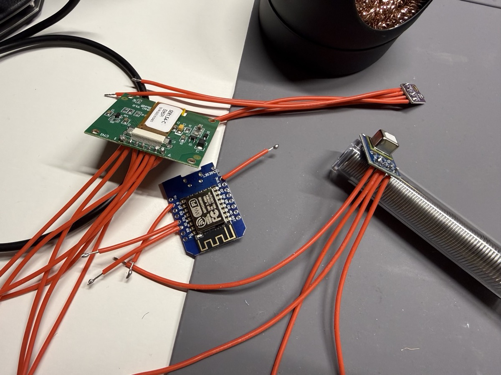
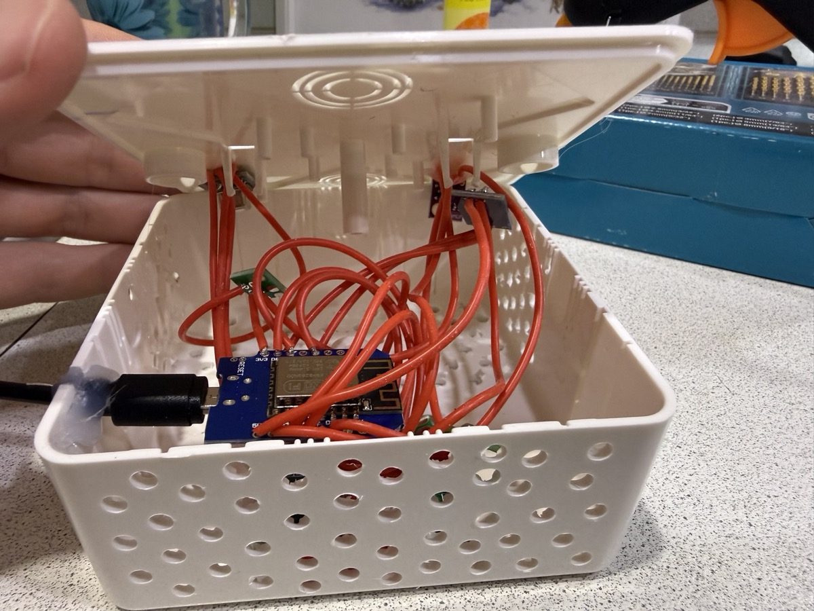
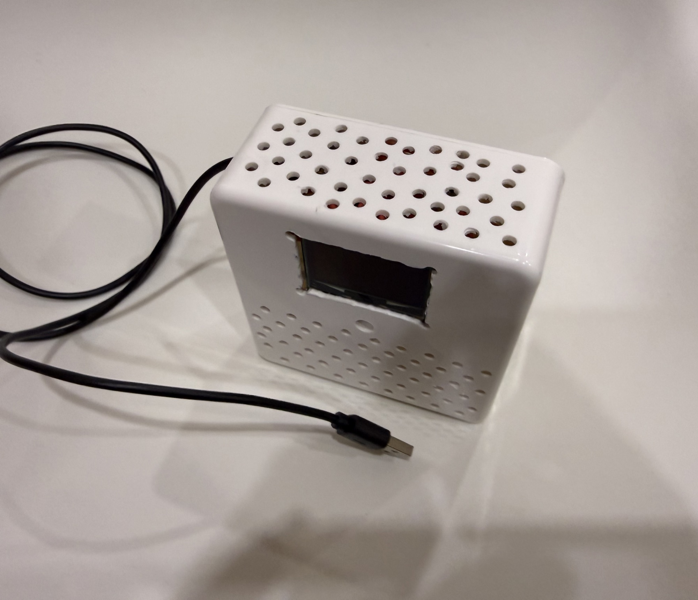
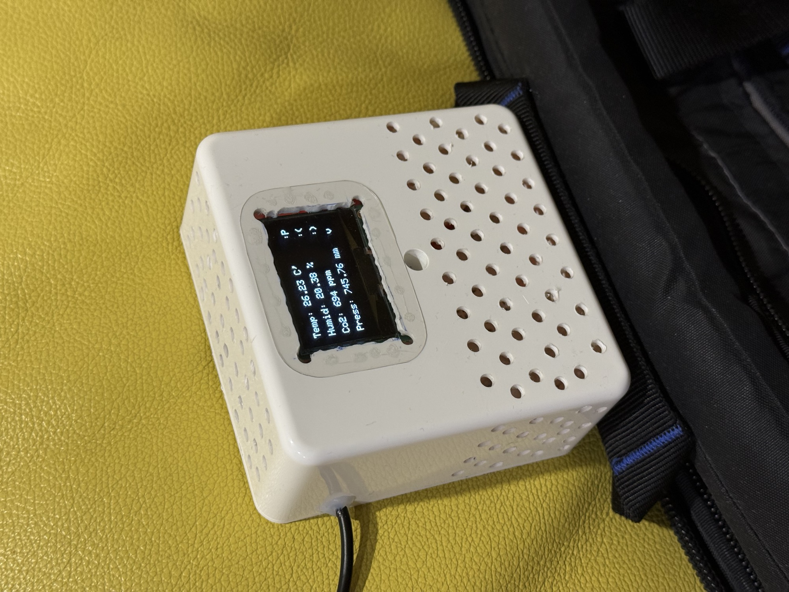

# Home air quality monitor

Standalone indoor air quality monitoring system with Wi‑Fi access.  
Measures CO₂, temperature, humidity and atmospheric pressure.  
Uses cached sensor readings with periodic updates.

## Features

– CO₂ monitoring  
– Temperature and humidity measurement  
– Atmospheric pressure sensing  
– Real‑time data display on OLED  
– Wi‑Fi access for on‑demand data requests  
– Cached sensor readings  
– Periodic sensor measurement (no measurements on request)  
– Modular architecture (separate files and classes)  
– Standalone operation

## Hardware

– ESP8266  
– OLED display SSD1309 (SPI interface, powered via step‑down converter from 5 V)  
– BME280 (temperature, humidity, pressure)  
– SCD41 (CO₂ sensor)

## Software

– Platform: Arduino / ESP8266  
– Language: C++  
– Architecture: modular, class‑based  
– Sensor communication: I²C  
– Display interface: SPI  
– Wi‑Fi: HTTP requests for reading cached data  
– Sensor logic: periodic measurement with cached values

### Libraries

– Adafruit BME280  
– Sensirion SCD4x  
– SSD1309 OLED library  
– ESP8266 Wi‑Fi libraries

## Wiring

BME280 and SCD41 sensors are connected via the I²C bus and powered at 3.3 V.

The OLED display is powered through a step‑down converter from 5 V.  
This design prevents I²C bus overload and ensures stable sensor operation.

## Thermal and ventilation design

The enclosure is intentionally spacious to minimize internal heat buildup and measurement drift.

– Powered from an external 5 V 2 A power supply with thermal headroom  
– CO₂, temperature and humidity sensors are placed in the lower part of the enclosure  
– Multiple ventilation openings around the perimeter allow cooler air intake  
– Warm air exits through openings on the top cover above the display and main board  

This passive airflow design reduces self‑heating effects from the CO₂ sensor, display and power components, improving measurement accuracy during continuous operation.

## Mechanical reliability and serviceability

– A removable (non‑glued) enclosure is used, allowing the device to be disassembled for repair, part replacement or component reuse  
– The power cable enters the enclosure and is mechanically fixed inside it; strain relief is applied to the cable itself, not to the PCB, to avoid damaging the board and to preserve the possibility of reusing it if needed  
– Hot glue is used for cable fixation due to its fast curing time and reversibility when disassembly is required

## Reliability considerations

A one‑minute measurement interval significantly reduces sensor wear and thermal stress, leading to an estimated long‑term operational lifespan (10+ years) for the device components under typical indoor use

## Usage

1. Assemble hardware according to the wiring  
2. Install required libraries  
3. Flash firmware to ESP8266  
4. Connect to Wi‑Fi  
5. Request current readings via HTTP (returns last measured values) or view them on the OLED display

## Photos

Photos of the assembled device and display output are provided below.

## License

MIT

## Support

If you find this project useful:

TON: UQCQclFDQnQkHI4bJETisvn4QAZevjMWx5mjC3AErZaXvhlU  
USDT: TSiRAGH2apuygsgYP7Q9mS48WN4gDS6D5o  
BTC: 1HCZ7KsmVoiDrvPpnZ5jLQPp7mi7xWR7fi
